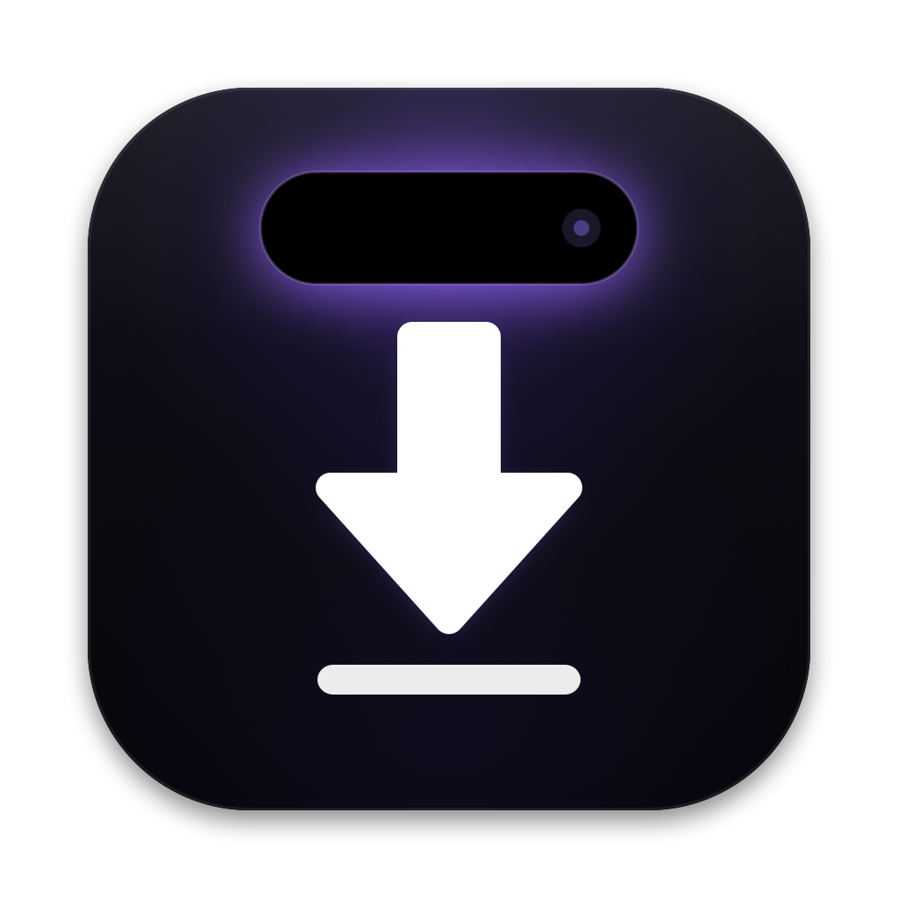
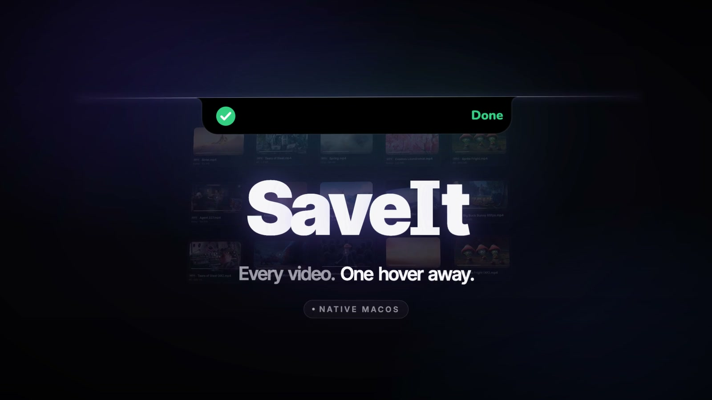
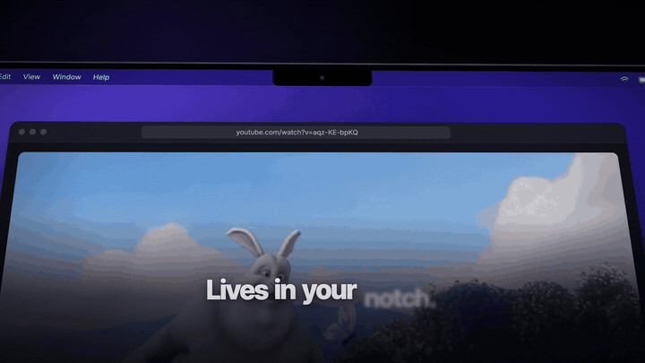

<div align="center">



# SaveIt

**Hover your notch. Paste a link. Save any video.**



<br>

[](https://github.com/uhrichsam4/SaveIt/releases/latest/download/SaveIt-macOS.zip)
&nbsp;
[](https://github.com/uhrichsam4/SaveIt/releases/latest/download/SaveIt-Windows.zip)

[▶ Watch the promo video](https://github.com/uhrichsam4/SaveIt/releases/latest/download/SaveIt-Promo.mp4) · [First launch](#first-launch) · [Build from source](#build-from-source)

</div>

---

SaveIt is a tiny video downloader that lives in your MacBook's notch. Move the mouse to the camera, a black
island drops down, paste a link, pick a quality and a folder, and it downloads. Click the result to find the
file. No Dock icon, no windows to manage.

<div align="center">

</div>

## Features

- **Lives in the notch.** Hover the camera and the island drops down; move away and it melts back in. On Macs
  without a notch it's a small pill at the top-center of the screen.
- **Paste and go.** Paste a link and press Enter. If a link is already on your clipboard, SaveIt offers it
  with one click.
- **Quality presets.** Best (MP4, H.264/AAC for QuickTime), 1080p, 720p or MP3 audio. Your choice is remembered.
- **Pick any folder.** Downloads go to `~/Downloads` by default; choose another folder any time.
- **Live-activity progress.** While downloading, the island shrinks to a slim pill with a progress ring and
  percentage. Hover it for the title, speed, time left and Cancel.
- **Done in one click.** A checkmark when it finishes, then *Show in Finder* or *Open*.
- **Readable errors.** Short messages instead of log dumps, with a Retry button. When a site changes and
  yt-dlp needs an update, SaveIt tells you, and **Update yt-dlp** is one menu click away.
- **Stays out of the way.** Menu bar icon, no Dock icon, clicks pass through the island when you're not
  using it, and it uses next to no CPU while idle.
- **Works on sites yt-dlp supports.** YouTube and many more.

## First launch

### macOS (14 Sonoma or later, Apple silicon and Intel)

1. Download **SaveIt-macOS.zip** and unzip it.
2. Drag **SaveIt.app** into your **Applications** folder.
3. Open it. SaveIt isn't signed with an Apple Developer ID, so macOS will block it the first time:
   open **System Settings → Privacy & Security**, scroll down and click **Open Anyway** next to the SaveIt
   message, then confirm.

   Or, in Terminal:

   ```sh
   xattr -dr com.apple.quarantine /Applications/SaveIt.app
   ```

4. Look for the ⬇︎ icon in the menu bar, then hover your notch.

The first time you download something, SaveIt spends a few seconds setting itself up (see
[How it works](#how-it-works)).

### Windows

1. Download **SaveIt-Windows.zip**, unzip it and run SaveIt.
2. Windows SmartScreen may warn about an unrecognized app: click **More info → Run anyway**.

On Windows, SaveIt lives at the **top-center of the screen**. It has the same island UI, a tray icon, and
downloads its tools on first run.

## How it works

SaveIt is a native SwiftUI app wrapped around two excellent open-source tools:

- **[yt-dlp](https://github.com/yt-dlp/yt-dlp)** finds and downloads the video.
- **[FFmpeg](https://ffmpeg.org)** merges video and audio and converts to MP3.

You don't have to install anything. On first use, SaveIt downloads the official standalone yt-dlp (checked
against its published SHA-256 checksums) and a static FFmpeg build into
`~/Library/Application Support/SaveIt/bin`. If you already have them via Homebrew (`/opt/homebrew/bin` or
`/usr/local/bin`), SaveIt uses those instead. **Update yt-dlp** in the menu keeps it current.

## Build from source

Requirements: macOS 14+, Xcode (Swift 6).

```sh
git clone https://github.com/uhrichsam4/SaveIt.git
cd SaveIt
./build.sh              # universal SaveIt.app + dist/SaveIt-macOS.zip
./build.sh --install    # also installs to ~/Applications and launches it
```

The app icon is generated by `swift scripts/make_icon.swift`.

## Credits

- **[yt-dlp](https://github.com/yt-dlp/yt-dlp)** (Unlicense) and **[FFmpeg](https://ffmpeg.org)**
  (LGPL/GPL; static macOS builds from [eugeneware/ffmpeg-static](https://github.com/eugeneware/ffmpeg-static)).
  Both are downloaded at runtime and are not bundled in this repository.
- Inspired by **[yoinks](https://github.com/pablostanley/yoinks)** by Pablo Stanley.
- Promo footage, video only, short clips:
  - Blender Foundation / Blender Studio open movies, licensed Creative Commons Attribution
    ([blender.org](https://www.blender.org) · [studio.blender.org](https://studio.blender.org)):
    - *Big Buck Bunny* © Blender Foundation (CC BY 3.0)
    - *Sintel* © Blender Foundation (CC BY 3.0)
    - *Tears of Steel* © Blender Foundation (CC BY 3.0)
    - *Spring* © Blender Animation Studio (CC BY 4.0)
    - *Cosmos Laundromat: First Cycle* © Blender Institute (CC BY 4.0)
    - *Sprite Fright* © Blender Studio (CC BY 4.0)
    - *Agent 327: Operation Barbershop* © Blender Animation Studio (CC BY 4.0)
  - NASA, public domain (no endorsement implied): *Artemis I: Launch to Splashdown Highlights* and
    *"Home" — 4K Views from Space* (NASA Johnson).
  - Sound was synthesized for the promo; no third-party music.

## Please download responsibly

SaveIt is a tool. Only download videos you own or have permission to save, and respect each site's terms and
the rights of creators. Don't use SaveIt to pirate or redistribute other people's work.

## Creator

Made by **Sam**. Say hi:

- X: [@ClipCenter101](https://x.com/ClipCenter101)
- Discord: `samiamfx`

## License

[MIT](LICENSE) © 2026 uhrichsam4
